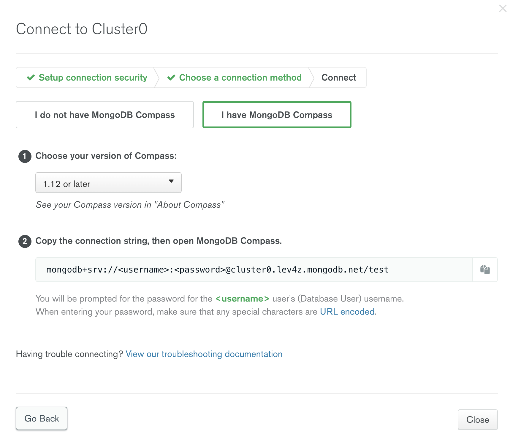

# Steps

1. Create an account, cluster, user and network access at [mongodb.com] (https://www.mongodb.com/basics/mongodb-atlas-tutorial)

2. Update application.properties, the mongodb.com console has the string you need 

3. mvn quarkus:dev

4. In your browser, `http://localhost:8080/todostream.html`

Note: I have found that changes to the listener code do not hot reload well, you likely have to stop the Quarkus dev mode and restart it

5. Now go create/update todo documents

